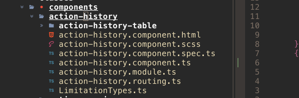

# Adjacent.nvim

A tiny telescope extension to find files in the same directory as the current buffer.

---

## The problem

You're working a on a large codebase with a lot of directories and similar file names. Usually you're working on components or modules for an extended period. You want to quickly be able to find the relevant associated files. But also be able to jump into another component without having to manage some sort of bookmarks.

## The solution

Being able to search files adjecent to the one you're currently working on. In the example shown below i can just search for "scss" instead of the file name.



--- 

## Installaton

- (Telescope)[https://github.com/nvim-telescope/telescope.nvim]
- Install using your favorite plugin manager (here i'm using packer)

```lua
...
use({ "MaximilianLloyd/adjacent.nvim" })
..

```

### Register telescope extension
```lua
telescope.load_extension("adjacent")
```


### Todo
- [] Send adjacent files to quickfix list
